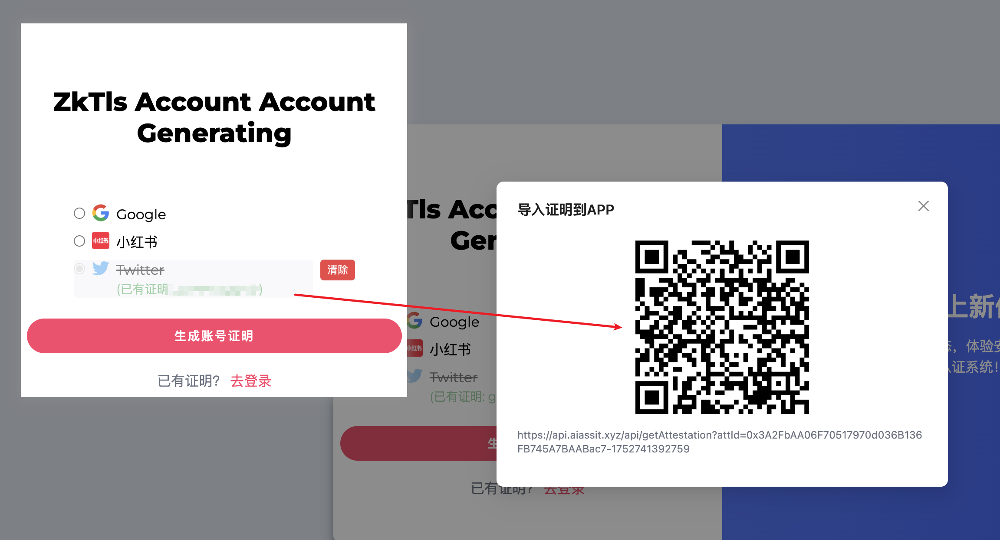
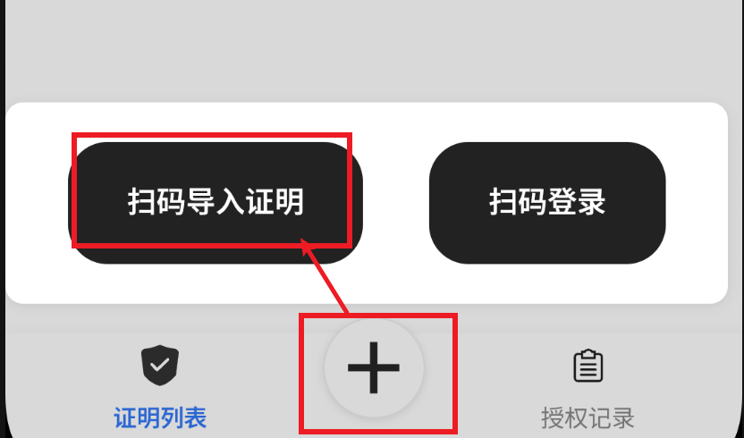
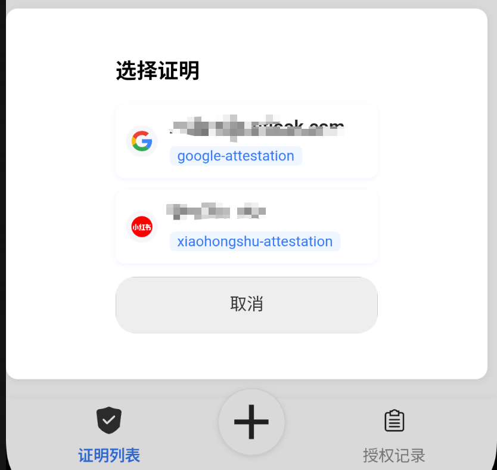
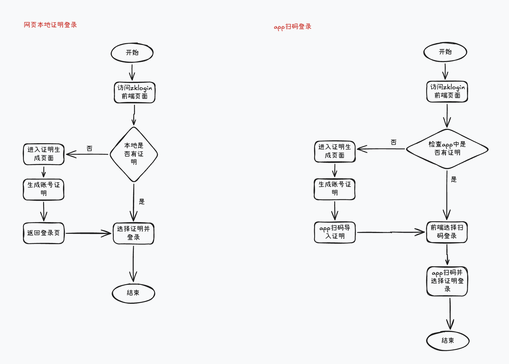

# ZKTLS Login : 基于ZKTLS技术的用户认证系统

## 目录
- [项目介绍](#项目介绍)
- [项目演示地址](#项目演示地址)
- [操作说明](#操作说明)
  - [网页端登录](#网页端登录)
  - [移动端登录](#移动端登录)
- [业务流程](#业务流程)
- [安装与依赖](#安装与依赖)
  - [前端](#前端)
  - [后端](#后端)
  - [移动端](#移动端)
- [构建与启动](#构建与启动)
  - [后端服务](#后端服务)
  - [前端服务](#前端服务)
- [部署流程](#部署流程)
- [常见问题](#常见问题)
- [扫码登录与移动端配合](#扫码登录与移动端配合)

>  ***项目运行依赖Primus插件***


## 项目介绍
ZKTLS Login 是一套基于零知识证明（ZK）和 TLS 技术的新一代用户认证系统，能够在第三方不提供OAuth协议的情况下实现第三方登录。项目基于Primus ZKTLS技术构建。用户可通过 Google、Twitter、小红书等社交账号生成Attestation，并通过Attestation登录系统，实现安全、隐私、便捷的多平台一键登录。

- **后端**：基于 Spring Boot，负责证明校验(ZkLogin登录)、会话管理、权限控制等。
- **前端**：基于 React + TailwindCSS，提供注册(证明生成)、登录(证明登录)、首页等交互界面，集成 ZKTLS JS SDK(Privided by Primus Labs) 实现证明生成与验证。
- **移动端**：使用UNI App开发，可实现扫码登录。移动端APP理论全平台支持，目前仅提供Android版本的安装包，在项目的`/assets/apk/`中，[点我下载](./assets/apk/zktls-login.apk)。

> 网页端已经是完整的系统，提供移动端是为了是系统更加全面，如果不符合参赛规则，可以忽略移动端项目，.

## 项目演示地址

[https://monad-hackathon2.aiassit.xyz/](https://monad-hackathon2.aiassit.xyz/)

## 操作说明
### 网页端登录
1. 访问 [https://monad-hackathon2.aiassit.xyz/](https://monad-hackathon2.aiassit.xyz/)
2. 首次进入页面没有证明，需要点击[去生成](https://monad-hackathon2.aiassit.xyz/register)到证明页面
3. 选择要生成证明的数据源，点击生成
4. 生成完成后，回到登录页面，点击登录即可

### 移动端登录
1. 到[证明生成页面](https://monad-hackathon2.aiassit.xyz/register)，生成证明，然后点击证明，即可弹出二维码

2. 打开APP，点击下方的"+"，选择“导入证明”
   
3. 回到前端页面，在登陆页选择“扫码登录”
4. 用手机打开APP，点击下方的"+"，选择“扫码登录”
5. 在弹出的页面中选择你要使用的登录的证明，即可完成登录
   


## 业务流程


## 安装与依赖

### 前端
- Node.js 23+，推荐使用 [nvm](https://github.com/nvm-sh/nvm) 管理
- 依赖见 `zktls-login-frontend/package.json`

### 后端
- JDK 17 及以上
- Gradle 8.10及以上
- Gradle Wrapper（已内置，无需单独安装）
- 依赖见 `zktls-login-backend/build.gradle`

### 移动端
使用UNI App开发，请使用[UNI-APP](https://uniapp.dcloud.net.cn/)

## 构建与启动

### 后端服务
1. 进入后端目录：
   ```bash
   cd zktls-login-backend
   ```
2. 构建并启动服务：
   ```bash
   ./gradlew bootRun
   ```
   默认监听端口为 `8080`，可在 `src/main/resources/application.yaml` 修改。

### 前端服务
1. 进入前端目录：
   ```bash
   cd zktls-login-frontend
   ```
2. 安装依赖：
   ```bash
   npm install
   ```
3. 启动开发环境：
   ```bash
   npm start
   ```
   默认访问地址为 [http://localhost:3000](http://localhost:3000)

***如需修改后端api接口地址，请在[config.js](zktls-login-frontend/src/config/config.js)中修改***

4. 构建生产包：
   ```bash
   npm run build
   ```

### 移动端
```
npm install
```

## 部署流程

1. **后端部署**：
   - 可通过 `./gradlew bootRun` 启动，或使用 `./gradlew build` 生成 jar 包后用 `java -jar` 部署。
   - 生产环境建议使用 Nginx/Apache 反向代理，或容器化部署。

2. **前端部署**：
   - 运行 `npm run build` 生成静态文件，部署至任意静态资源服务器（如 Nginx、Vercel、Netlify 等）。
   - 注意配置前端配置文件中的 API 地址，确保能正确访问后端服务。
3. **移动端部署**：

本地运行使用HbuildX, 项目仓库提供了安卓安装包

## 操作说明

### 生成账号证明
1. 进入注册页 `/register`，选择社交平台（如 Google、Twitter、小红书）。
2. 点击“生成账号证明”，根据指引完成证明生成。
3. 证明将自动保存在本地浏览器。

### 登录系统
1. 进入登录页 `/login`，选择已有的社交账号证明。
2. 点击“Log In”发起登录请求。
3. 登录成功后自动跳转至首页 `/home`。

### 退出登录
- 在首页点击“退出登录”按钮即可。
- 首页有权限检查，如果没有登录权限则无法访问。

## 常见问题

- **Q: 启动后端报 Java 版本错误？**
  - A: 请确保本地 JDK 版本为 17 及以上。
- **Q: 前端无法访问后端 API？**
  - A: 检查前端 配置 `src/config/config.js`，确保 API 地址正确。
- **Q: 如何切换社交平台或清除证明？**
  - A: 注册页可清除本地证明，重新生成。

## 扫码登录与移动端配合

### 前端扫码登录流程
1. 在登录页切换到“扫码登录”模式，页面会自动生成一个唯一的二维码（内容为随机uuid）。
2. 用户使用 ZKTLS APP 扫描二维码。
3. APP 识别二维码中的 clientId（uuid），弹出本地证明选择弹窗。
4. 用户在 APP 端选择一个本地证明，点击“登录”。
5. APP 向后端 `/api/app/login` 提交 `{ loginId: clientId, dataSource, attestation }`。
6. 后端校验成功后，前端页面会自动轮询 `/api/scan-login-status?uuid=xxx`，检测到登录成功后自动跳转首页。

### APP 端扫码登录配合
1. 在 APP 底部栏点击“扫码登录”按钮，扫描网页二维码。
2. 扫码后弹出“选择证明”弹窗，展示本地所有可用证明。
3. 选择证明后，APP 自动调用 `/api/app/login` 完成扫码登录。
4. 登录成功后，APP 端会提示“登录成功”。

### 相关接口说明
- `/api/scan-login-status?uuid=xxx`：前端轮询，查询扫码登录状态。
- `/api/app/login`：APP 端提交扫码登录请求，参数为 `{ loginId, dataSource, attestation }`。
- `/api/app/updateStatus`：APP 端可选，扫码后可通知后端当前扫码状态。

### 操作指引
- **Web端扫码登录**：
  1. 打开登录页，切换到“扫码登录”模式。
  2. 用 ZKTLS APP 扫描二维码。
  3. 在 APP 端选择证明并确认登录。
  4. 网页端检测到登录成功后自动跳转。
- **APP端扫码登录**：
  1. 在底部栏点击“扫码登录”按钮。
  2. 扫描网页二维码，选择证明，点击登录。
  3. 登录成功后会有提示。

如需自定义扫码登录流程或对接第三方APP，请参考源码及接口文档。
---

如有更多问题，请联系项目维护者。
